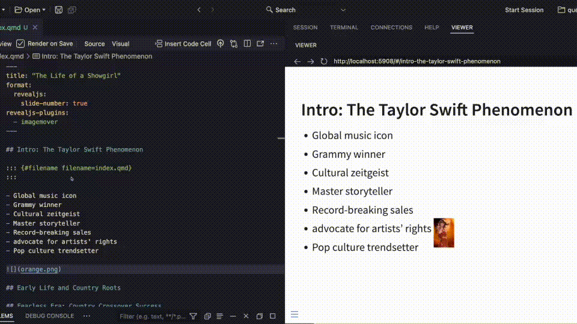

# editable Extension For Quarto Revealjs

This Revealjs plugin allows the repositioning and resizing of images directly in the previewed slides.

## Installing

```bash
quarto add emilhvitfeldt/quarto-revealjs-editable
```

This will install the extension under the `_extensions` subdirectory.
If you're using version control, you will want to check in this directory.

## Using

Designate the extension as a `revealjs-plugins` in the yaml file.

```yaml
revealjs-plugins:
 - editable
```

Next, at the following anywhere in the document.
Set the `filename` to match the name of the document it is in.

```markdown
::: {#filename filename=example.qmd}
:::
```

To designate that you want to move and resize an image, add the `editable` id to the image like so.

```markdown
{#editable}
```

Note that this extension will completely rewrite the `{}`.

Once you have rerendered the slides, each image with the id should be movable and resizable using the corners.
Holding shift while pulling the corners respects aspect ratios.

Once you are happy with the sizes, open the menu (M), go to tools, and click "Save Moved Images". This will prompt you to save a file. Choose the same folder you are working in to overwrite the document you are in. Rerender, and the images should be locked in place.

## Demo Video



## Example

Here is the source code for a minimal example: [example.qmd](example.qmd).

